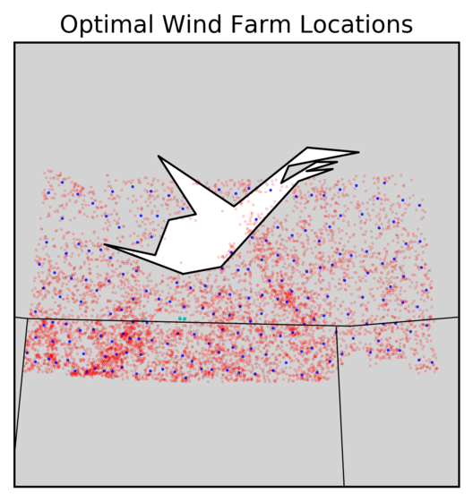

# Canadian-Forest-Fires

  

Published Paper and Abstract [here](http://journal.stemfellowship.org/toc/sfj/3/1)

Inspired by the tragedy at Fort McMurray, my team wanted to discover ways to reduce the frequency and size of forest fires; we began by looking at the National Fire Database. This database describes all Canadian forest fires since the 1930s and underscores features such as size, location, and other government responses. To describe the fires in more detail, we attributed each fire to the nearest weather station to determine weather conditions at the time of the fire, namely precipitation, pressure, wind speed, and temperature. After a couple of covariance graphs and casual observations, we discovered that low humidity was a large contributing factor and that 40% of the naturally occurring fires were sparked by a lightning strike.

Soon it was evident that we needed to build structures to decrease the speed of winds and the number of lightning strikes. After a couple of days to mull the problem in our heads, only one proposal seemed plausible, the green light of wind farms in fire-prone regions. Using the geographic data of previous fires, we ran a k-means algorithm to group forest fires into 200 regions, all in northern Alberta, where most fires are crowned. We then proposed to place wind farms at the centroids of the regions to create a protective area against forest fires. All in all, our proposal won first place and landed me a spot on the STEM Fellowship's Data Science Team. For a detailed look at our procedure, download our report [here](https://chongcurtis.com/affects_of_climate_change_on_forest_fires.pdf)!
